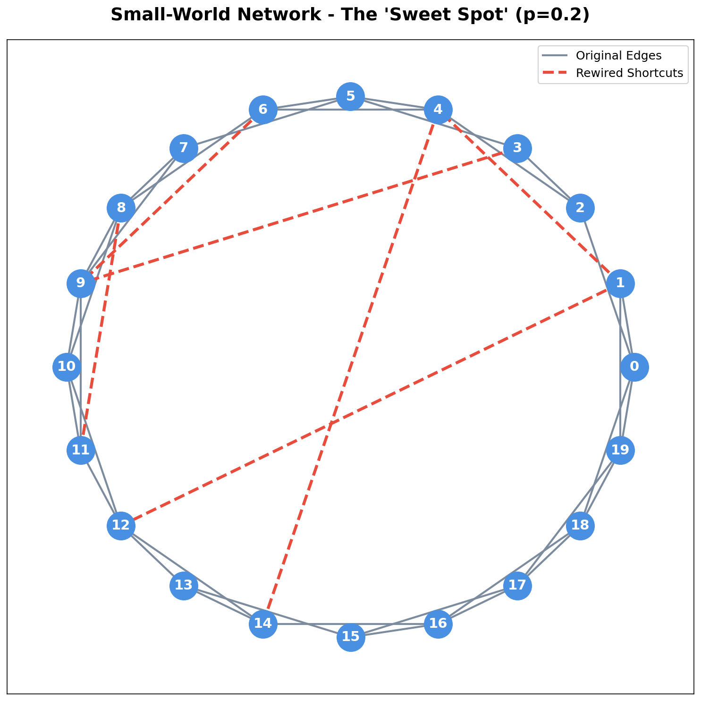

# Social Network Analysis Projects

A comprehensive collection of network analysis projects featuring **Small-World Networks** and **Email Network Analysis** with beautiful visualizations, interactive code, and a modern web presentation.

## 🌐 Live Website

**Visit the live demo**: `https://prxyansh.github.io/sna-network-analysis/`



## 📋 Project Overview

This repository contains two major social network analysis projects:

### 1. Small-World Networks (Watts-Strogatz Model)
Explores the fascinating phenomenon of "six degrees of separation" through the Watts-Strogatz model, demonstrating how networks transition from regular lattices to random networks while maintaining small-world properties.

### 2. Email Network Analysis (EU Research Institution)
Comprehensive analysis of real-world email communication patterns in a large European research institution, featuring:
- **Link Analysis**: PageRank and Eigenvector Centrality
- **Community Detection**: Label Propagation Algorithm
- **Influence Scoring**: Multi-metric influence analysis
- **Anomaly Detection**: Isolation Forest for outlier identification
- **Link Prediction**: Machine Learning-based connection forecasting

## 📁 Project Structure

```
SNA/
├── website/                           # Web presentation
│   ├── index.html                     # Main dual-project website
│   ├── styles.css                     # Modern gradient styling
│   ├── script.js                      # Interactive features & tab switching
│   ├── images/                        # Small-World visualizations
│   │   ├── regular_network.png
│   │   ├── small_world_network.png
│   │   └── random_network.png
│   └── project_finl_outputs/         # Email network analysis outputs
│       ├── subgraph.png
│       ├── degree_distribution.png
│       ├── community_view.png
│       ├── influence_scores.csv
│       └── ... (24 analysis files)
│
├── Project_finl/                      # Email Network Analysis
│   ├── project.py                     # Main analysis script
│   ├── email-Eu-core.txt              # Dataset (1,005 nodes, 25,571 edges)
│   ├── outputs/                       # Generated analysis results
│   └── requirements.txt               # Python dependencies
│
├── SmallWrld.py                       # Watts-Strogatz implementation
├── generate_graphs.py                 # Visualization generator
├── requirements.txt                   # Project dependencies
├── DEPLOYMENT_GUIDE.md                # GitHub Pages setup
└── README.md                          # This file
```

## 🚀 Quick Start

### Project 1: Small-World Networks

1. **Install dependencies**:
   ```bash
   pip install -r requirements.txt
   ```

2. **Run the interactive visualization**:
   ```bash
   python SmallWrld.py
   ```
   This will display three graphs showing the network evolution.

3. **Generate images for the website**:
   ```bash
   python generate_graphs.py
   ```

### Project 2: Email Network Analysis

1. **Navigate to the project directory**:
   ```bash
   cd Project_finl
   ```

2. **Install dependencies**:
   ```bash
   pip install -r requirements.txt
   ```

3. **Run the comprehensive analysis**:
   ```bash
   python project.py
   ```
   This will generate all analysis outputs including:
   - Link analysis (PageRank, Eigenvector centrality)
   - Community detection visualizations
   - Influence scores
   - Anomaly detection results
   - Link prediction ROC curves

### View the Website Locally

1. **Start local server**:
   ```bash
   cd website
   python3 -m http.server 8080
   # Visit http://localhost:8080
   ```

2. **Explore both projects**: Switch between Small-World and Email Network tabs

## 🎯 Features

### Small-World Networks
- ✅ Complete Watts-Strogatz algorithm
- ✅ Configurable parameters (N, K, p)
- ✅ Network evolution visualization
- ✅ Clustering coefficient analysis
- ✅ Average path length calculations

### Email Network Analysis
- ✅ **Dataset**: 1,005 nodes, 25,571 edges (EU research institution)
- ✅ **Link Analysis**: PageRank & Eigenvector Centrality
- ✅ **Community Detection**: Asynchronous Label Propagation
- ✅ **Influence Scoring**: Combined PageRank + Betweenness
- ✅ **Anomaly Detection**: Isolation Forest (5% contamination)
- ✅ **Link Prediction**: Random Forest with 5 graph features (AUC scores)
- ✅ **Comprehensive Visualizations**: 24 output files (PNGs, CSVs, GEXF)

### Interactive Website
- ✅ Modern gradient design with glass morphism
- ✅ Dual-project tab switching interface
- ✅ Rich content with algorithm explanations
- ✅ Interactive particle background
- ✅ Responsive design for all devices
- ✅ Downloadable reports and datasets
- ✅ Visual distinction between original and rewired edges
- ✅ Support for three network types (regular, small-world, random)

### Website Features
- ✅ Beautiful, minimal design with smooth animations
- ✅ Embedded PowerPoint presentation viewer
- ✅ Interactive code display with syntax highlighting
- ✅ Copy-to-clipboard functionality
- ✅ Responsive design (mobile, tablet, desktop)
- ✅ Network visualization gallery
- ✅ Educational content and explanations
- ✅ Download options for code and presentation

### Visualizations
- ✅ Regular Network (p=0): High clustering, long paths
- ✅ Small-World Network (p=0.2): The "sweet spot"
- ✅ Random Network (p=1): Low clustering, short paths

## 🧠 Network Analysis Concepts

### Small-World Networks

The Watts-Strogatz model demonstrates how real-world networks achieve both:

1. **High Clustering**: Like regular lattices (friends of friends are friends)
2. **Short Path Lengths**: Like random graphs (six degrees of separation)

**Algorithm Overview**:
```python
1. Start with a regular ring lattice (N nodes, each connected to K neighbors)
2. Rewire each edge with probability p:
   - Keep one endpoint fixed
   - Reconnect to a random node (avoiding self-loops and duplicates)
3. Result: Network interpolates between regular (p=0) and random (p=1)
```

**Parameters**: N=20 nodes, K=4 neighbors, p=0.2 rewiring probability

### Email Network Analysis Tasks

#### 1. Link Analysis
- **PageRank**: Identifies influential nodes based on incoming connections
- **Eigenvector Centrality**: Measures influence based on neighbor importance
- **Output**: Top 20 ranked nodes with centrality scores

#### 2. Community Detection
- **Algorithm**: Asynchronous Label Propagation
- **Purpose**: Discover natural clusters (departments, research groups)
- **Visualization**: Color-coded communities in network graph

#### 3. Influence Analysis
- **Combined Metric**: 0.5 × PageRank + 0.5 × Betweenness Centrality
- **Identifies**: Both prestigious members and critical connectors
- **Output**: Influence scores and rankings for all nodes

#### 4. Anomaly Detection
- **Algorithm**: Isolation Forest (5% contamination rate)
- **Features**: Degree, betweenness, closeness, clustering, PageRank
- **Detects**: Bots, external collaborators, isolated specialists

#### 5. Link Prediction
- **Classifier**: Random Forest (100 estimators)
- **Features**: Common neighbors, Jaccard coefficient, Adamic-Adar index, 
  Preferential attachment, Resource allocation
- **Evaluation**: ROC curves with AUC scores for each feature

## 🛠️ Technologies Used

### Backend
- **Python 3.13**
- **NetworkX**: Network analysis and graph generation
- **Matplotlib**: Network visualizations
- **scikit-learn**: Machine learning (Isolation Forest, Random Forest)
- **Pandas**: Data manipulation and CSV exports

### Frontend
- **HTML5**: Semantic markup with dual-project structure
- **CSS3**: Modern gradients, glass morphism, animations, grid layouts
- **JavaScript (Vanilla)**: Tab switching, particle effects, interactive features
- **Google Fonts**: Inter & JetBrains Mono typography

## 📊 Dataset Information

### Email-EU-core Network
- **Source**: Large European research institution
- **Timespan**: 18 months of email communications
- **Nodes**: 1,005 (individual email addresses)
- **Edges**: 25,571 (directed email exchanges)
- **Average Degree**: 50.88 connections per person
- **Density**: 0.0506 (5.06% of possible connections exist)
- **Type**: Directed graph representing sender-receiver relationships

## 📊 Included Files

### Code Files
- `SmallWrld.py`: Interactive visualization with three graphs
- `generate_graphs.py`: Batch image generation for website

### Website Files
- `index.html`: Complete website structure
- `styles.css`: Professional, modern styling (~700 lines)
- `script.js`: Interactive features and smooth UX
- `SmalWrld.pptx`: Academic presentation

### Documentation
- `README.md`: This project overview
- `DEPLOYMENT_GUIDE.md`: Detailed deployment instructions
- `website/README.md`: Website-specific documentation

## 🎨 Website Highlights

### Design Principles
- **Minimal**: Clean, distraction-free interface
- **Modern**: Gradients, animations, glass morphism
- **Accessible**: Semantic HTML, readable typography
- **Fast**: Optimized images, lazy loading
- **Responsive**: Works on all devices

### Interactive Features
- Smooth scroll navigation
- Tab switching for code sections
- Copy-to-clipboard for code
- Fade-in animations on scroll
- Navbar scroll effects
- Lazy loading images

## 📚 Academic Context

This project demonstrates understanding of:

- Graph theory fundamentals
- Network topology analysis
- Small-world phenomena
- Clustering coefficient
- Average path length
- Python scientific computing
- Data visualization
- Web development

## 🎓 Usage for Presentation

### For Your Professor
1. Share the live website URL
2. Highlight the interactive code display
3. Walk through the visualizations section
4. Download button for the PowerPoint
5. Explain the implementation details

### Presentation Flow
1. Start with the hero section (introduction)
2. Show the three visualizations
3. Explain the code implementation
4. Open the PowerPoint for detailed slides
5. Discuss real-world applications

## 🔧 Customization

### Change Network Parameters

Edit parameters in the Python files:

```python
N = 20       # Number of nodes
K = 4        # Nearest neighbors
P_small = 0.2   # Rewiring probability
```

### Update Website Colors

Modify CSS variables in `website/styles.css`:

```css
:root {
    --primary: #4A90E2;
    --accent: #E74C3C;
    --dark: #1A1A2E;
    /* ... more variables */
}
```

### Add More Sections

Follow the existing pattern in `index.html` and `styles.css`.

## 📦 Installation

### Prerequisites
- Python 3.7+ (tested with 3.13)
- pip package manager
- Git (for deployment)
- Modern web browser

### Setup

```bash
# Clone or download the project
cd /Users/prx./Documents/SNA

# Create virtual environment (optional but recommended)
python3 -m venv .venv
source .venv/bin/activate  # On Windows: .venv\Scripts\activate

# Install dependencies
pip install -r requirements.txt

# Run the code
python SmallWrld.py

# Generate website images
python generate_graphs.py

# Test website locally
cd website
python3 -m http.server 8000
# Visit http://localhost:8000
```

## 🚀 Deployment

See the detailed [DEPLOYMENT_GUIDE.md](DEPLOYMENT_GUIDE.md) for complete instructions.

Quick deploy:
```bash
cd website
chmod +x deploy.sh
./deploy.sh
```

## 📝 References

### Small-World Networks
- **Original Paper**: Watts, D. J., & Strogatz, S. H. (1998). Collective dynamics of 'small-world' networks. *Nature*, 393(6684), 440-442.
- **NetworkX Documentation**: https://networkx.org/
- **Small-World Network (Wikipedia)**: https://en.wikipedia.org/wiki/Small-world_network

### Email Network Analysis
- **Dataset**: Email-EU-core network from SNAP (Stanford Network Analysis Project)
- **PageRank**: Page, L., et al. (1999). The PageRank Citation Ranking
- **Label Propagation**: Raghavan, U. N., et al. (2007). Near linear time algorithm to detect community structures
- **Isolation Forest**: Liu, F. T., et al. (2008). Isolation Forest for anomaly detection

## 👨‍� Author

**Priyansh Kumar Paswan**
- Roll Number: 205124071
- Institution: National Institute of Technology, Tiruchirappalli
- Course: Social Network Analysis (3rd Semester)
- GitHub: [@prxyansh](https://github.com/prxyansh)

## �🙏 Acknowledgments

- **Duncan Watts & Steven Strogatz**: For the groundbreaking small-world model
- **NetworkX Team**: For the excellent graph library
- **scikit-learn Team**: For machine learning implementations
- **Python Community**: For amazing scientific computing tools
- **NIT Trichy**: For the academic opportunity

## 📄 License

This project is open source and available for educational purposes.

## 📞 Support

For questions or issues:
- Open an issue on GitHub: https://github.com/prxyansh/sna-network-analysis/issues
- Check the DEPLOYMENT_GUIDE.md for GitHub Pages setup
- Review individual project READMEs in `Project_finl/` and `website/`

---

**Built with ❤️ for Social Network Analysis**

🌐 **Live Website**: https://prxyansh.github.io/sna-network-analysis/

*Project created October 2025*
